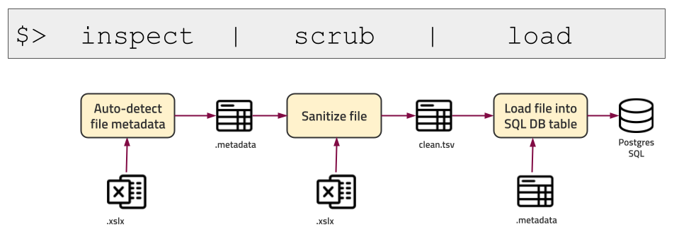

# Lassoer

Add lassoer to your ETL toolkit to clean up dirty, misbehaving text-files and then load them into a SQL database for later transformation.

## Inspect

Use the `inspect` utility to guess at the metadata of a .csv file and try to determine column data types (strings, dates, numbers, etc.) 

Navigate to its [README.md](./inspect/README.md) for more details.

## Scrub

Use the `scrub` utility to sanitize text-files (.csv, .xls, etc) and optionally normalize columns which contain locale specific dates and currencies, if provided with a .metadata file.

Navigate to its [README.md](./scrub/README.md) for more details.

## Load

Use the `load` utility to copy the contents of a tab-separated input file into a SQL Database table. 

Navigate to its [README.md](./load/README.md) for more details.

# Installation

If you are running nix on your system, just `cd` into one of the sub directories and execute `nix-build` to generate an executable in `$(wd)/result/bin/`.

# License

MIT License
